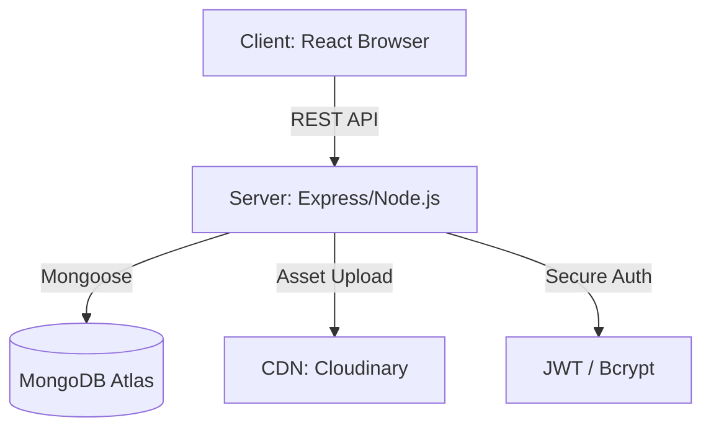

# Project Report: Ansh Ebook - Integrated Digital Media Platform

---

## 🎓 Academic Submission Document
**Project Name:** Ansh Ebook  
**Project Owner:** Navnit Nayan  
**Department:** Computer Science & Engineering (CSE)  
**Course:** B.Tech (Bachelor of Technology)  
**University:** Dr. A.P.J. Abdul Kalam Technical University (AKTU)  
**Batch:** 2026 Passout  
**Official Email:** navnitnayan2002@gmail.com  
**Contact:** 7360996609  

---

## 📋 1. Project Overview & Objective
**Ansh Ebook** is a unified digital ecosystem designed to consolidate diverse creative formats (Literature, Audio, and Music) into a single, high-performance web interface.

### 1.1 Problem Statement
In the current digital landscape, content creators face "Platform Fragmentation," where their ebooks, podcasts, and poetry are scattered across multiple third-party services. This results in:
- Diluted brand identity.
- Poor user retention.
- Lack of centralized content management.

### 1.2 Proposed Solution
A high-performance Single Page Application (SPA) built on the MERN stack that offers:
- A centralized Admin CMS for all media types.
- A premium, high-density UI for end-users.
- SEO-optimized infrastructure for discoverability.

---

## 🛠️ 2. Feasibility Study

### 2.1 Technical Feasibility
The project uses the MERN stack (MongoDB, Express, React, Node.js), which is highly scalable and well-documented. Integration with Cloudinary CDN ensures that server resources are not overwhelmed by large media files.

### 2.2 Operational Feasibility
The system is designed with a "No-Code" Admin Dashboard, meaning content can be managed by non-technical users without touching the underlying source code.

### 2.3 Economic Feasibility
By utilizing open-source technologies (React, Node.js) and free-tier cloud services (MongoDB Atlas, Cloudinary, Render), the project is highly cost-effective while maintaining professional standards.

---

## ⚙️ 3. System Design & Database Schema

### 3.1 Data Dictionary (MongoDB)
| Collection | Key Fields | Description |
| :--- | :--- | :--- |
| **Users** | `email`, `password`, `profile_pic` | Encrypted user credentials and profile state. |
| **Ebooks** | `title`, `description`, `pdf_url` | Metadata and CDN link for digital books. |
| **Music** | `title`, `artist`, `audio_url` | Track information and audio source links. |
| **Podcasts** | `episode_title`, `category`, `audio_url` | Episode tracking and category classification. |
| **Shayari** | `content`, `category`, `author` | Text-based poetic works. |

### 3.2 System Architecture Diagram

---

## 💻 4. Development Methodology (SDLC)

### 4.1 Agile Iterative Model
The project followed an **Agile Lifecycle**, focusing on modularity:
- **Phase 1: Sprinting**: Rapid prototyping of the UI using Framer Motion.
- **Phase 2: Backend Logic**: Developing the Secure Auth and CRUD controllers.
- **Phase 3: Integration**: Connecting the React frontend to the Express API.
- **Phase 4: Deployment**: Continuous Deployment (CD) via GitHub to Render.com.

---

## 🔐 5. Security Protocols & Optimization

### 5.1 Identity & Access Management
- **Stateful Protection**: JWT (JSON Web Tokens) used to secure all admin-level API routes.
- **Encryption**: Standard BCrypt (2^10 rounds) for hashing passwords before database entry.
- **XSS & CSRF Protection**: Sanitized inputs and automated HTTP security headers via the backend middleware.

### 5.2 SEO & Discoverability
- **JSON-LD Schema**: Implemented BreadcrumbList and WebSite schema for technical SEO.
- **Open Graph (OG)**: Customized social sharing previews for better link click-through rates.

---

## 🚀 6. Future Scope of the Project
- **Artificial Intelligence**: Implementing a "Recommender System" based on user reading habits.
- **Mobile Ecosystem**: Porting the React frontend to **React Native** for Android/iOS apps.
- **Monetization**: Integrating a secure payment gateway for premium content access.
- **Multilingual Support**: Real-time translation of Shayari and Ebooks into multiple regional languages.

---

## 🏁 7. Conclusion
**Ansh Ebook** is not just a website; it is a scalable software solution for the modern creator economy. By consolidating diverse media into a single high-performance MERN architecture, it delivers a superior user experience while maintaining a robust, secure backend.

---
**Project Lead:** Navnit Nayan  
**Department:** B.Tech CSE (2026 Batch)  
**University:** AKTU, Uttar Pradesh  
**Contact:** 7360996609 | navnitnayan2002@gmail.com  
**Date:** March 24, 2026
